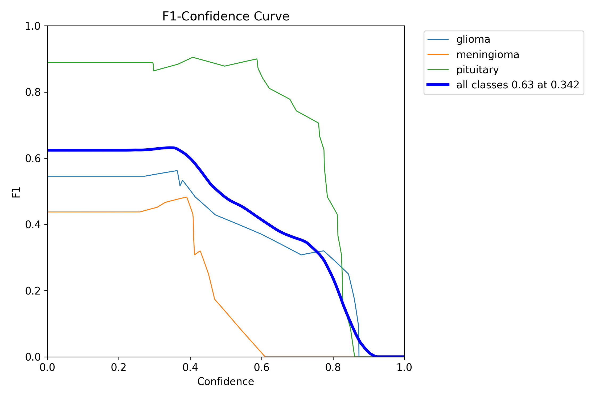
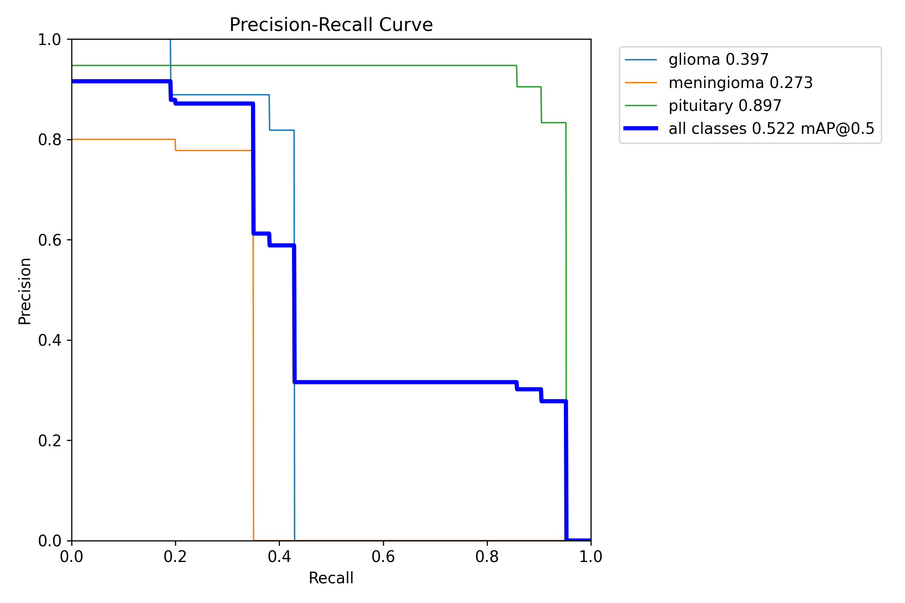
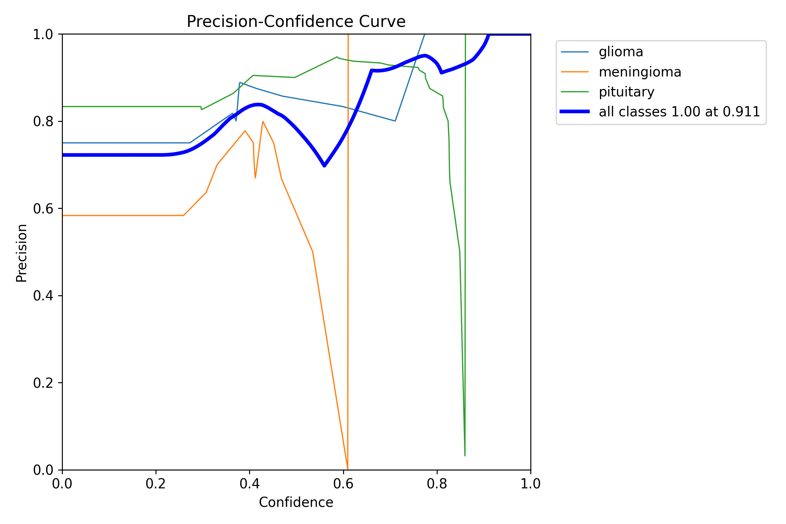
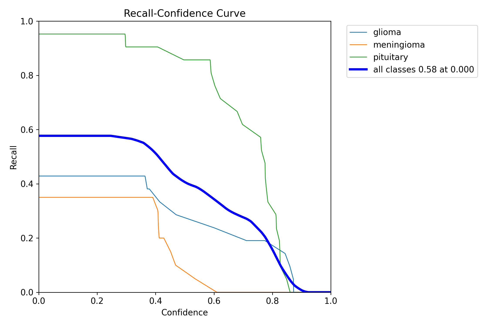
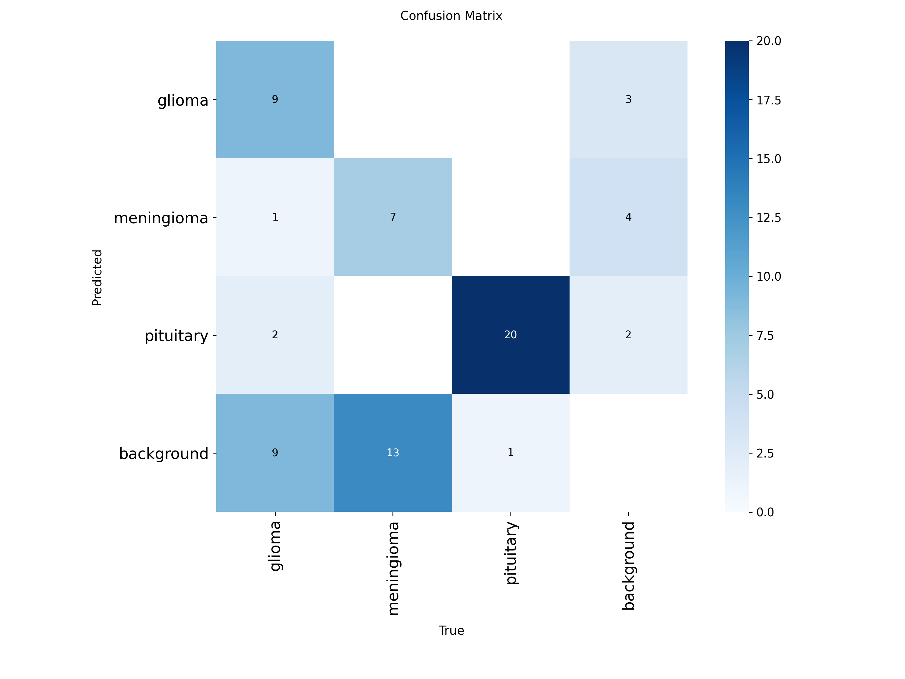
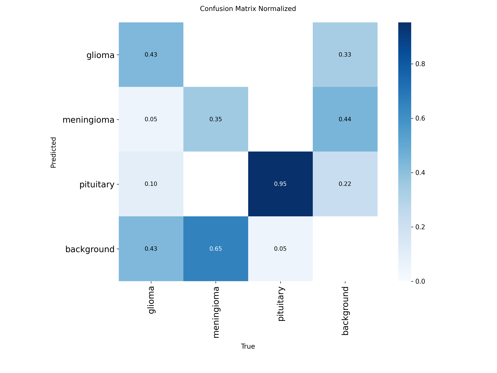

# YOLO26 Model Tumor

Projeto de Visão Computacional aplicado à segmentação e classificação de tumores cerebrais em exames de imagem. A implementação utiliza YOLO para identificar as classes `glioma`, `meningioma` e `pituitary`.

**Demonstração online:** [https://model-tumor-yolo26.streamlit.app/](https://model-tumor-yolo26.streamlit.app/)

## Introdução

O objetivo do projeto é construir um sistema capaz de reconhecer padrões visuais em imagens médicas e apoiar a análise de tumores cerebrais de forma automática. Para isso, o dataset foi reorganizado para o formato exigido pelo YOLO, o modelo foi treinado para segmentação e uma interface web foi criada para permitir a inferência sobre novas imagens.

## Estrutura do projeto

- `setup/organize-dataset.py`: prepara o dataset no formato YOLO e gera o arquivo `data.yaml`.
- `setup/model-train.py`: executa o treinamento do modelo de segmentação.
- `setup/validation-train.py`: contém validações e análises auxiliares do treino.
- `app.py`: interface web em Streamlit para inferência.
- `result_train/`: gráficos e matrizes de confusão gerados durante a avaliação.

## Dependências

O projeto separa as dependências em dois arquivos para manter o ambiente organizado:

- `requirements.txt`: bibliotecas usadas pela aplicação web em Streamlit, incluindo a interface e a inferência.
- `requirements-train.txt`: bibliotecas usadas no treinamento da IA e no processamento do dataset.

Essa separação facilita instalar apenas o necessário para cada etapa do projeto.

## Dataset

O dataset utilizado neste projeto foi obtido no Kaggle:

- [Brain Tumor Dataset - Segmentation and Classification](https://www.kaggle.com/datasets/indk214/brain-tumor-dataset-segmentation-and-classification/data)

Licença informada na página do dataset: **Apache 2.0**.

Como o conjunto original não estava pronto no formato esperado pelo YOLO, foi necessário reorganizá-lo antes do treinamento. O processo incluiu:

- separar as imagens por partição de treino, validação e teste;
- converter as máscaras de segmentação para anotações no padrão do YOLO;
- gerar a estrutura de pastas `images/` e `labels/`;
- criar o arquivo `data.yaml` com os caminhos corretos do dataset.

Após essa preparação, o dataset passou a conter as três classes:

- `glioma`
- `meningioma`
- `pituitary`

O pipeline de preparação cria a estrutura padrão do YOLO com `images/train`, `images/val`, `images/test` e seus respectivos rótulos em `labels/`.

## Arquitetura do modelo

O treinamento utiliza um modelo YOLO de segmentação (`yolo26s-seg.pt`) com os principais ajustes:

- `epochs=200`
- `batch=32`
- `optimizer='AdamW'`
- `freeze=10`
- `degrees=15`
- `mask_ratio=1`
- `patience=50`

## Resultados

A pasta [`result_train/`](result_train) contém os gráficos gerados na avaliação do modelo.

### Curvas de desempenho









### Matrizes de confusão





### Observações dos gráficos

Os gráficos mostram a relação entre confiança, precisão, recall e F1-score para cada classe. A matriz de confusão ajuda a visualizar onde o modelo acerta com mais frequência e onde ainda existem confusões entre as classes.

De forma geral, os resultados indicam que a classe `pituitary` tende a ser melhor reconhecida do que `glioma` e `meningioma`, o que também aparece nas curvas e na matriz de confusão.

## Execução local

### 1. Organizar o dataset

```bash
python setup/organize-dataset.py
```

### 2. Treinar o modelo

```bash
python setup/model-train.py
```

### 3. Abrir a interface

```bash
streamlit run app.py
```

## Observações

O desempenho do modelo depende fortemente da qualidade das anotações do dataset. Se as máscaras estiverem incorretas ou muito grandes, o treinamento pode aprender segmentações ruins, mesmo quando as métricas aparentam ser boas.

## Conclusão

O projeto mostra como a Visão Computacional e o Deep Learning podem ser aplicados ao problema de tumores cerebrais. A reorganização do dataset foi essencial para adequá-lo ao padrão do YOLO, e os resultados obtidos nas curvas e matrizes de confusão confirmam a viabilidade da abordagem.

## Repositório de código

O código-fonte deste projeto está organizado neste repositório e a demonstração online pode ser acessada em:

- [https://model-tumor-yolo26.streamlit.app/](https://model-tumor-yolo26.streamlit.app/)
